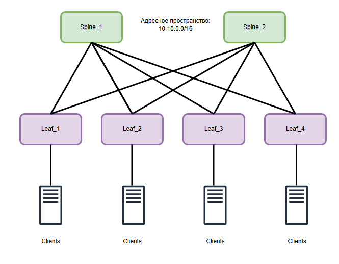

# Проектирование адресного пространства

## Цель:
Cобрать схему CLOS и распределить адресное пространство.

## Решение

## Адресный план
10.x.y.z 

Где:  
X - адрес площадки/ДатаЦентра;  
y - назначение сети;  
(0-9) - для p2p сетей (2560 адресов, или 1230 p2p сетей /31, или 615 сетей /30);  
(10-12) - для Loopback Адресов (пример: l0 - 10, l1 - 11, l2 - 12);  
(13 - 255) - зарезервировнные диапозоны для других задач/подразделений/сервисов;  
z - значение по порядку;  

Пусть на проектируемый ДЦ выделен диапазон адресов - 10.10.0.0/16

__Loopback адресация__
Для порядкового значения хостов выбираем следующие диапазоны  
[0-199] - Для LEAF  
[200 - 256] - Для Spine

| Hostname | Loopback 0 | Loopback 1 | Address 2 |
| --- | --- | --- | --- |
Leaf-1 | 10.10.10.1 | 10.10.11.1 | 10.10.12.1
Leaf-2 | 10.10.10.2 | 10.10.11.2 | 10.10.12.2
Leaf-3 | 10.10.10.3 | 10.10.11.3 | 10.10.12.3
Leaf-4 | 10.10.10.4 | 10.10.11.4 | 10.10.12.4
Leaf-N | 10.10.10.1 | 10.10.11.1 | 10.10.12.1
Spine-1 | 10.10.10.201 | 10.10.11.201 | 10.10.12.201
Spine-2 | 10.10.10.202 | 10.10.11.202 | 10.10.12.202

__p2p адресация__

| Hostname A | Hostname B | p2p network | Address A | Address B |
| --- | --- | --- | --- | --- |
| Spine_1 | Leaf_1 | 10.10.0.0/31 | 10.10.0.0 | 10.10.0.1
| Spine_1 | Leaf_2 | 10.10.0.2/31 | 10.10.0.2 | 10.10.0.3
| Spine_1 | Leaf_3 | 10.10.0.4/31 | 10.10.0.4 | 10.10.0.5
| Spine_1 | Leaf_4 | 10.10.0.6/31 | 10.10.0.6 | 10.10.0.7
| Spine_2 | Leaf_1 | 10.10.0.8/31 | 10.10.0.8 | 10.10.0.9
| Spine_2 | Leaf_2 | 10.10.0.10/31 | 10.10.0.10 | 10.10.0.11
| Spine_2 | Leaf_2 | 10.10.0.12/31 | 10.10.0.12 | 10.10.0.13
| Spine_2 | Leaf_2 | 10.10.0.14/31 | 10.10.0.14 | 10.10.0.15

##  
## Схема сети

